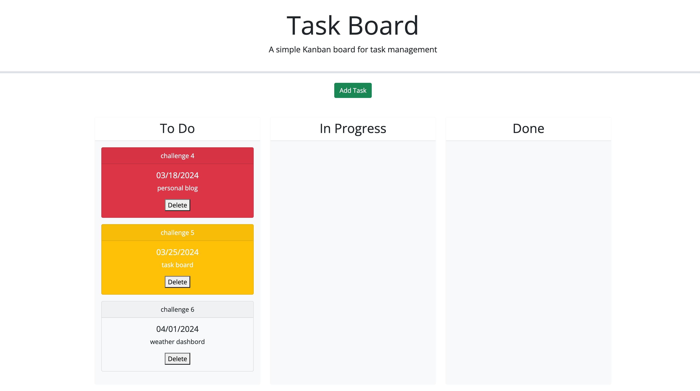
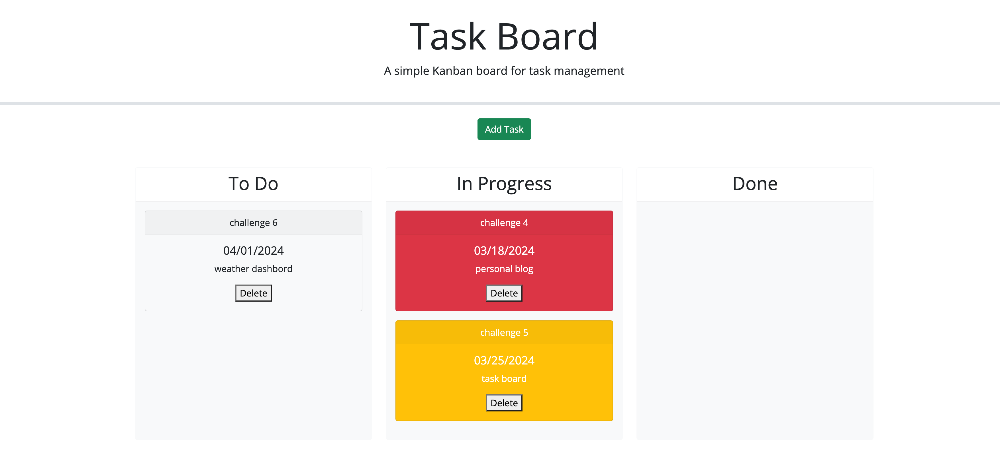
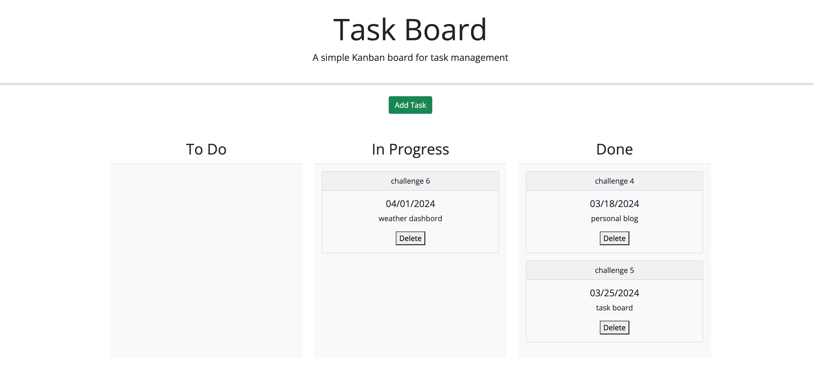

# task-board
This web-site is a Task Board

## Description
This web-site was made with HTML, CSS and JavaScript.
It helps people to add individual project tasks, manage their state of progress and track overall project progress accordingly.

## Installation
N/A

## Usage
1. Open:  https://aksanah.github.io/task-board/
2. Press Add Task button to define a new task. Enter the title, description and deadline date for the new task into a modal dialog. Click the Add Task button for that task. Then the properties for that task are saved in localStorage.
3. To drag a task to a different progress column the task's progress state is updated accordingly and will stay in the new column after refreshing.
4. Clicking the delete button for a task will remove this task from the task board and will not be added back after refreshing.

## Technologies Used
- HTML
- CSS
- JavaScript

## Mock-Up
The following images show the wed-site appearance and functionality:

